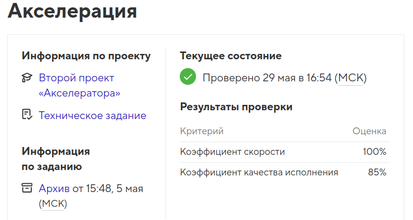

# Проект Lifetour

Проект выполнен в рамках финального этапа _"Акселератор"_ на профессиональном онлайн‑курсе «[Профессия «Фронтенд-разработчик»](https://htmlacademy.ru/profession/frontender/classic)» от [HTML Academy](https://htmlacademy.ru).

<h4>Проект создан в 2025 году</h4>

  

- Студент: [Виктория Калугина](https://up.htmlacademy.ru/javascript-individual/2/user/1788421).
- Проект: [Fitness](https://toryatoria.github.io/accelerator-project-2/)

Разработка велась полностью самостоятельно ( акселератор не подразумевает помощь наставников).  
Продолжительность проекта: 27 дней (8.04 - 5.05 2025 года).  
Цель задания - выполнить проект в установленный срок в соответствии с техническим заданием, требованиями по подготовке к защите и критериями качества.  

- [Критерии качества](https://htmlacademy.notion.site/4814c0ba58c240c4ad87ed2bacef2ff4)

- [Техническое задание](./readme/Readme_tz.md)

## Описание
**Lifetour** — это сайт для организации походов в горы. 

## Техническое задание
## Технические требования

- **Адаптивность сетки:** отображено на макете. Контейнер фиксированной ширины.
- **Используемая методология:** БЭМ.
- **Используемые фреймворки:** нет.
- **Используемый препроцессор:** Sass (SCSS-синтаксис).
- **Используемый инструмент автоматизации:** поставляется в самом начале работы. Модификация сборки запрещена.
- **Кроссбраузерность:** Chrome, Firefox.
- **JavaScript:** необходимо реализовать компоненты с табами, слайдерами, аккордеонами.
- **Элементы помечены как контентная область в макете** — стилизуются по каскаду: добавлять атрибут class для контентных элементов, помеченных в макете красным, запрещено.

## Брейкопойнты:

- мобильная версия — 320px;
- планшетная версия — 768px;
- десктопная версия — от 1366px и выше.

## Общее

- Фоны, которые упираются в края макета, должны тянуться на всю страницу.

- Для реализации слайдеров используется библиотека `swiper.js`.

# Техническое задание

- [Mакет](https://www.figma.com/design/K4icPKuBxu9q0NNngkzlzF/%D0%9F%D1%83%D1%82%D0%B5%D1%88%D0%B5%D1%81%D1%82%D0%B2%D0%B8%D1%8F.-%D0%90%D0%BA%D1%81%D0%B5%D0%BB%D0%B5%D1%80%D0%B0%D1%82%D0%BE%D1%80-%D0%A4%D1%80%D0%BE%D0%BD%D1%82%D0%B5%D0%BD%D0%B4--21-?node-id=110-2409&p=f&t=8Sy3d4gF4nxZZt7r-0)

- [UI-kit](https://www.figma.com/design/K4icPKuBxu9q0NNngkzlzF/%D0%9F%D1%83%D1%82%D0%B5%D1%88%D0%B5%D1%81%D1%82%D0%B2%D0%B8%D1%8F.-%D0%90%D0%BA%D1%81%D0%B5%D0%BB%D0%B5%D1%80%D0%B0%D1%82%D0%BE%D1%80-%D0%A4%D1%80%D0%BE%D0%BD%D1%82%D0%B5%D0%BD%D0%B4--21-?node-id=201-2940&p=f&t=8Sy3d4gF4nxZZt7r-0)

- [готовая сборка](https://github.com/htmlacademy/accelerator-project-2)

- [Обязательные требования по подготовке к защите проекта](https://htmlacademy.notion.site/ed59b1e3e63c40f994772db37500d0f9#ea35a566b0034abf8ccb1887b6fddfeb)

- [Критерии качества](https://htmlacademy.notion.site/4814c0ba58c240c4ad87ed2bacef2ff4)

# Техническое задание

## Общие технические требования

- Адаптивность сетки: отображено на макете. Контейнер фиксированной ширины.
- Вёрстка не должна ломаться при изменении масштаба страницы.
- Используемая методология: БЭМ.
- Используемые фреймворки: нет.
- Используемый препроцессор: Sass (SCSS-синтаксис).
- Используемый инструмент автоматизации: поставляется в самом начале работы. Модификация сборки запрещена.
- Кроссбраузерность: Chrome, Firefox.
- Шрифт:Montserrat. Шрифт необходимо подобрать самостоятельно.
- JavaScript: необходимо реализовать компоненты с слайдерами, бургерное меню, формы.
- Элементы помечены как контентная область в макете — стилизуются по каскаду.
- Добавлять атрибут class для контентных элементов, помеченных в макете красным, запрещено.

**💡 При разногласиях стайлгайда и макета, макет считать приоритетным.**

## Требования заказчика

Сборка проекта доступна по ссылке ` https://github.com/htmlacademy/accelerator-project-2`

- Для начала работы сделайте fork репозитория или скачайте материалы архивом и работайте локально.
- Инструкция по работе находится в файле readme.md сборки;
  Используйте только предоставленную сборку, вносить изменения в сборку запрещено;
- Если вы использовали другие сборки или внесли изменения — такой проект мы проверить не сможем;
- Обязательно пользуйтесь линтерами из сборки при разработке для проверки кода и его форматирования;
- Текущий инструмент поможет оценить ваш проект перед отправкой, укажет на несоответствия и ошибки.

## Брейкпойнты:

- мобильная версия — от 320px;
- планшетная версия —от 768px;
- десктопная версия — от 1440px и выше.

## Общее

- Фоны, которые упираются в края макета, должны тянуться на всю страницу.

- Для реализации слайдеров используется библиотека swiper.js. Библиотеку в данном проекте подключаем по инструкции:
  - Инструкция использования swiper.js в проекте доступна по ссылке: `https://up.htmlacademy.ru/assets/intensives/production-frontender/20/swiper-spec.pdf`

### Все блоки

- У всех главных заголовков в каждом блоке есть полупрозрачный дублирующий текст.
- Дублирующий текст не должен быть прочитан скринриндером.

### Шапка

- Меню всегда должно находится в шапке.
- Работу меню без js предусматривать не нужно.
- Пункты — ссылки на соответствующий блок страницы.
- Мобильное меню при выборе пункта автоматически закрывается.
- При открытом мобильном меню скролл страницы блокируется.

### Промо блок

- Слайдер с пагинацией, без навигации.
- На планшете и мобильном слайдер переключается свайпом.
- Слайдер зациклен.
- На десктопе слайдер переключается буллетами.

### Ближайшие туры

- Слайдер с навигацией.
- Количество слайдов адаптируется к устройству по макету.
- Переключается по одному слайду. В крайнем положении кнопки навигации блокируются.
- В слайдере должно быть четыре слайда.

### Обучение

- Слайдер с навигацией.
- Количество слайдов адаптируется к устройству по макету
- Переключается по одному слайду.
- Слайдер не зациклен. В крайнем положении кнопки навигации блокируются.
- В слайдере должно быть пять слайдов.
- В блоке «Процесс обучения» всегда четыре элемента.

### О нас

- Текст никогда не наезжает на изображение.

### Отзывы

- Слайдер с навигацией.
- Количество слайдов адаптируется к устройству по макету.
- Переключается по одному слайду.
-  Слайдер не зациклен. В крайнем положении кнопки навигации блокируются.

### Преимущества

- Карточки Преимущества становятся слайдером в десктопном варианте.
- Слайдер с навигацией.
- Количество слайдов адаптируется к устройству по макету.
- Переключается по два слайда.
- Слайдер зациклен.

### Фотогалерея

- Слайдер с навигацией.
- Количество слайдов адаптируется к устройству по макету.
- Переключается по одному слайду.
- Слайдер зациклен.
- В десктопном режиме слайдер отключен.

### Остались вопросы?

- Форма отправляется по адресу https://echo.htmlacademy.ru
- Каждое поле является обязательным для отправки.
- Поле Телефон не должно принимать к отправке буквы. Поле должно иметь атрибут name="phone".
- В поле Email можно ввести только email, допускается локальный домен (.рф). Поле должно иметь атрибут name="email".
- Надписи «Телефон» и «Email» являются подписью для своих элементов форм.
- Вывод сообщения об ошибке при валидации стандартными средствами браузера + подсветка поля по стайлгайду.
- Вывод ошибки только после попытки отправки формы.

### Контакты

- Телефон и email — интерактивные элементы.
- Карту делать статичной картинкой.

### Подвал

- Все элементы подвала интерактивные.
